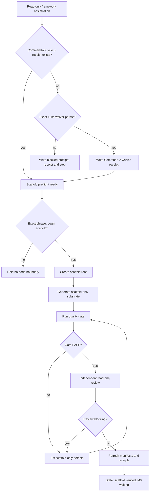
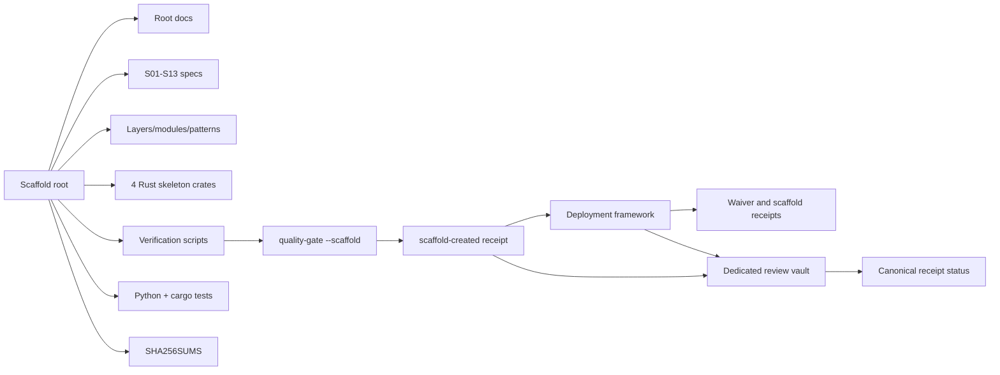
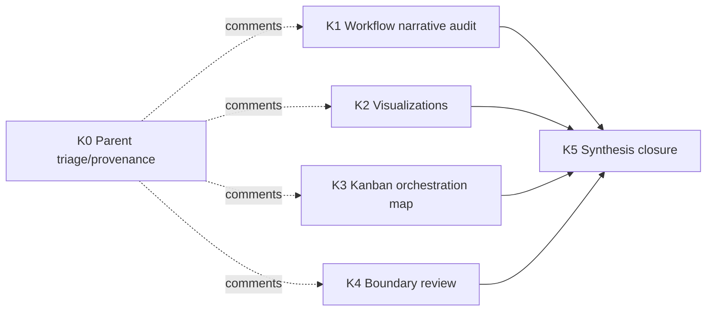
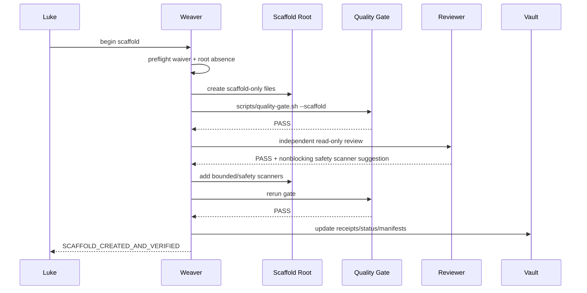
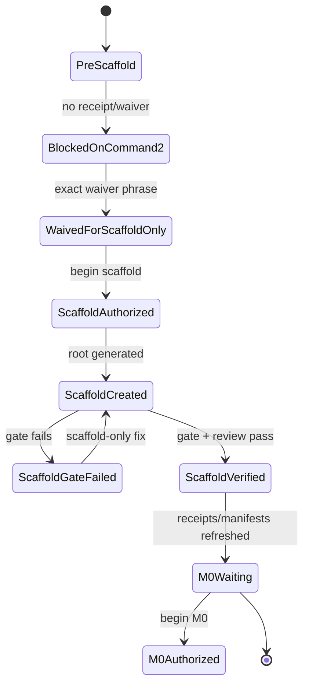

# Habitat Loop Engine Scaffold Workflow Visualizations

Created UTC: 2026-05-10T00:05:15Z
Status: text-first scaffold preservation diagrams
Boundary: diagrams describe scaffold authorization and verification only; M0/runtime execution remains blocked until explicit `begin M0`.
Related narrative: [scaffold-deployment-workflow.md](scaffold-deployment-workflow.md)
Related Kanban map: [scaffold-deployment-kanban-map.md](scaffold-deployment-kanban-map.md)

## How to read these diagrams

These Mermaid blocks are source artifacts, not generated binary attachments. They are intended to remain reviewable in plain markdown and renderable by Mermaid-aware viewers. Each diagram preserves one view of the same scaffold-only workflow:

- authorization flow: phrase-gated progression from read-only assimilation to `m0_waiting`;
- artifact topology: files and receipts created by the scaffold packet;
- Kanban graph: bounded fan-out/fan-in review work;
- verification sequence: command/review order used to close the scaffold receipt;
- state machine: allowed scaffold states and the only transition that can open M0.

Visual convention: solid arrows are required workflow transitions; dashed arrows are provenance/comment links; decision diamonds are authorization or verifier gates. Any failed gate loops back to scaffold-only correction, never to live runtime behavior.

## Authorization flow

Notes:

- `begin scaffold` authorizes only file/substrate creation and verification.
- A failing quality gate or blocking review can only produce bounded scaffold fixes.
- The terminal state is `M0 waiting`, not deployment or runtime operation.

## Artifact topology

Topology boundary:

- Rust crates are compile-safe skeletons, not executors.
- Scripts are verifier/safety surfaces, not daemons or cron jobs.
- Receipts and manifests are durable evidence that the scaffold is closed and M0 remains blocked.

## Kanban graph

Kanban reading rules:

- K0 is provenance and should stay parked unless Luke asks for board cleanup.
- K1-K4 may run in parallel because each is docs/review-only.
- K5 is the only fan-in card and should read parent handoffs before writing closure.
- No card may spawn live integrations, background services, cron jobs, or M0 runtime work.

## Verification sequence

Sequence guardrails:

- Review feedback can enrich bounded verifiers only.
- Receipt/status updates document the closed scaffold state.
- `SCAFFOLD_CREATED_AND_VERIFIED` is a preservation claim, not a deployment claim.

## State machine

State boundary:

- `M0Authorized` is shown only as a future gated state.
- The scaffold workflow stops at `M0Waiting` unless Luke separately gives the exact `begin M0` phrase.
